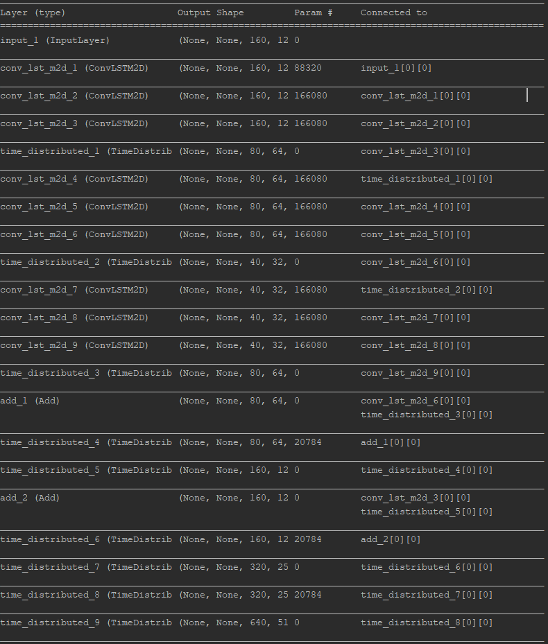
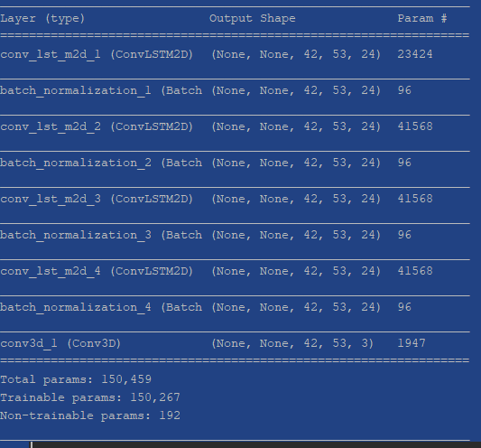
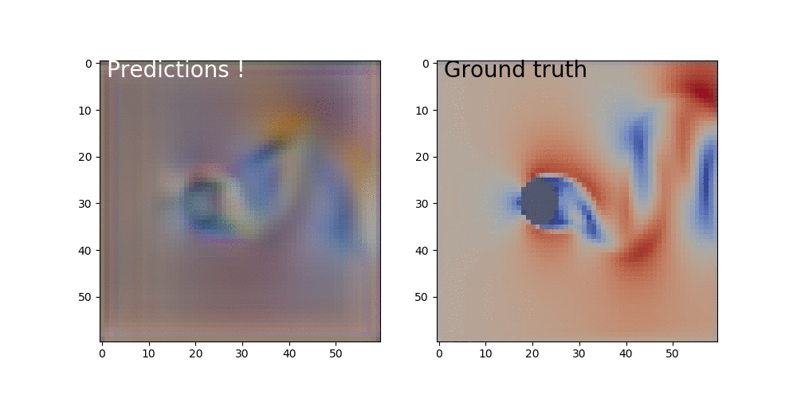
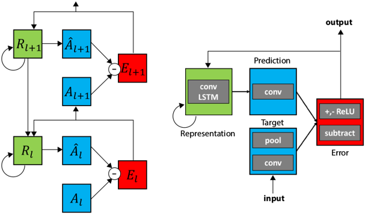
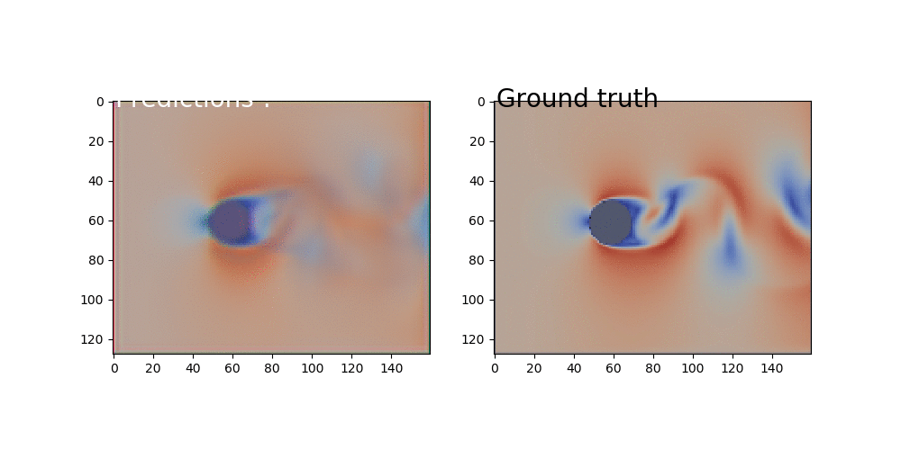
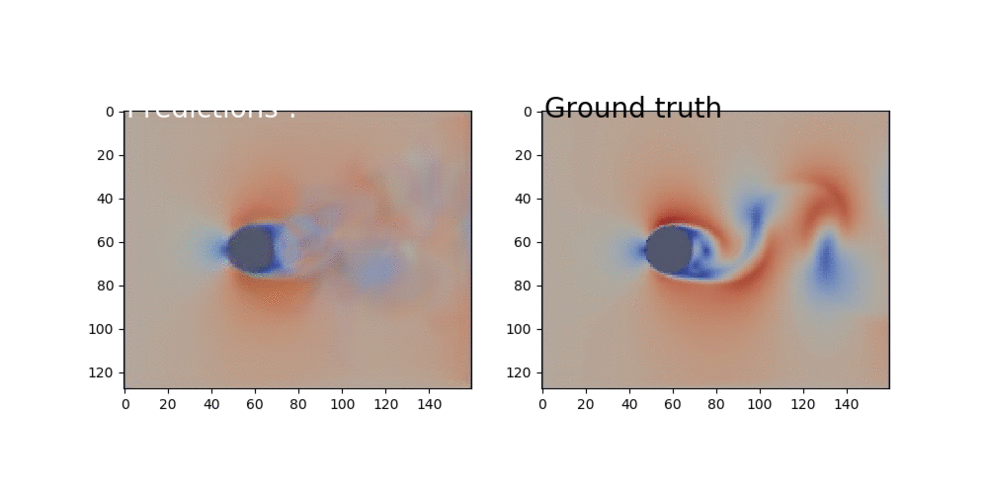

## week1
1. install OpenFoam| |Y| |@20181220| 
2. create Simple Mesh|BlockMeshDict , command “bl
3. boundary control|blockMeshDict|Y| |@20181228| 
4. structure of folders in OpenFoam| |Y| |@201901
5. fluid propeties|transportProperties|Y| |@20190
6. initial status|0 folder or setFiledsDict|Y| |@
7. slover selection| |N|don’t know how to select 
8. time control|controlDict|Y| |@20190102| 
9. region setting|setFiledsDic & command “setFile
10. run solution|command with solution name|Y| |@
11. visual and export|paraview foam.foam|Y| |@201
12. create polyhrel or complex mesh| |N|In proces
13. parallel computation in OpenFoam| |N|Low prio
14. set OpenFoam goal and simple demo| |N| | | 
15. Deep learning solution discovery| |N| | | 

### week2
Done:

1. Parallel computation in Openfoam
2. Simulate single shapes(square, cycle and trapezoidal) in the water flow.
3. Output vector plots.
4. create mesh with gmesh tools,  time costing.

Issue:

1. When I tried a triangle or two objects in the mesh, the error happen since computation couldn't reach convergence.
2. The files is too large, 1GB for 36 frames in a single simulate. This might be a problem when we create enough samples for CNN.

Next:

~~1. How to use(or choose peak) frames in CNN~~
~~2. How to create samples automatically~~
~~3. Know How solver works in the different situations.~~

1. understand the data meaning inside the frame files
2. change the velocity and angle  of flow also the size of object
3. simplify the animation, try "matplotlib.pyplot.quiver "
4. find if any stable status in the simulation
5. try to figure out the error of triangle issue

### week3
Done:
1. Automatic generate samples according to the object shape and angle of flow on seawolf.
  * Incoming flow angle is set from 0 degree to 90 degree with a step of 15 degree.
  * Shape is configured under the script `run` in each subfolder. [Example](/Samples/square_(-3%2C-3)_(3%2C-3)_(-3%2C3)_(3%2C3)_circle/run)
  * Samples generation can be found [here](/Samples)
  * For automatically generate all sampels, `runlist` has be set to call all `run` scripts under each subfolder.
2. Delete the temp files, only keep final frames
3. All samples can be found on seawolf, structure as follows:
`shape folder / flow angle folder(0-90 degree) / paraview folder`

Issue:
1. Can not call pravaview GUI through docker
2. Most of samples cannot reach a stable status.See [here](/img/square_3_3_1_45.png)
3. Number of samples are small(36), but number of frames are large(36\*150)

Next:
1. Label the samples or LTSM
2. Export Vector files automaticaly

### week4
1. Model summary
the input is resized and cropped 2D gray picture( to save time) with size 42*53, filter is stetted as  36. 
the validation data is the next frame of input. 
```
Layer (type)                 Output Shape              Param #   
=================================================================
conv_lst_m2d_1 (ConvLSTM2D)  (None, None, 42, 53, 36)  48096     
_________________________________________________________________
batch_normalization_1 (Batch (None, None, 42, 53, 36)  144       
_________________________________________________________________
conv_lst_m2d_2 (ConvLSTM2D)  (None, None, 42, 53, 36)  93456     
_________________________________________________________________
batch_normalization_2 (Batch (None, None, 42, 53, 36)  144       
_________________________________________________________________
conv_lst_m2d_3 (ConvLSTM2D)  (None, None, 42, 53, 36)  93456     
_________________________________________________________________
batch_normalization_3 (Batch (None, None, 42, 53, 36)  144       
_________________________________________________________________
conv_lst_m2d_4 (ConvLSTM2D)  (None, None, 42, 53, 36)  93456     
_________________________________________________________________
batch_normalization_4 (Batch (None, None, 42, 53, 36)  144       
_________________________________________________________________
conv3d_1 (Conv3D)            (None, None, 42, 53, 1)   973       
=================================================================

Total params: 330,013
Trainable params: 329,725
Non-trainable params: 288
```

2. Sample

Openfoam outputs 300 frames( a circle in the center), I picked up the last 200th to 300th frames  which look like more dynamic stable. Then I randomly choose the start frame with its 30 following frames as a piece of sample. The total number of sample is 100. 

3. Training

Epoch sets as 300, and loss function is binary_corssentropy, optimizer is adadelta. 

4. Result

After 300 epoch, loss reached to 0.655. I also tried to use this model to predict 15 frames with its previous 15 actual frames. Result looks very wired. Right now I make epoch as 1000, waiting for the refreshed result.

Done:

1. Initial ConvLSTM

Issue:
1. Low accuracy
2. Model modification
3. Sample generation

Next: 
1. Improve model
2. More samples

### week5
1. Some questions last week
* what's the time unit in control file
- The unit of time is seconds. For example, if dt = 0.025, write internal = 4, then we generate each files every 0.1 second. 
- color and axis of output picture
The coming flow speed is 1m/s, which is represented by neutral color. The color of faster flow is warmer, while the color of slower flow is colder. The axis is pixel of picture, which is not real size of output of openfoam.

2. Three models and their results
A. Original model( many to many)

We showed last week, result is not good.

B. Second model( many to many)

Compared to the first model, we used more convolutional LSTM layers(9 layers), then using more filter(48). After 100 epoches, the result is blow:

Figure1. Using 15 frames to predict 15 frames.

C. Prednet
This is a custom model which is created by coxlab. They successfully predict some videos clips for car driving. 

There are two results. First result is based on the sample samples as the second model.

Second result is based on the samples whose time interval is doubled since I want to make the difference between two frames more significant.


3. Issue.
A. I used MSE as cost function, after 150 epoches, all models can reach up to 0.0065 ~ 0.0089, but the prediction still not good enough. 
B. How should I significant the flow color, rather than all domain.
C. I used many to many model to train and predict frames, would it good to use many to one or one to many? ( I tried, but not enough time to modify the model)
D. For the car driving case, they use lots of samples(Gb), should I added more samples? but even this circle case, our model can not learn well.

4. next week
1. sample optimization
2. model optimization 

### Week6
1. Done

A. fix reading order bug and optimaze the three model:

1.Training: use Nth frame to predict (N+1)th frame
Prediction: use 1-10 frame to predict 2-11 frame, sliding window = 1 frame. ( only first few frame are good, since we use the predicting frames to do the prediction)


2.Training: Nth frame to predict (N+10)th frame
Prediction: use 1-10 frame to predict 11-20 frame, no sliding window. ( this is very good since all input are ground truth)


3.Training: use Nth frame to predict (N+1)th frame
Prediction: use one frame to predict next frame, like driving prediction (animation has a little problem. right side is prediction, left side is ground truth)


2. Issue

A. Learning still in a very stricted enviorment, without setting speed and angles
B. Predict based on Predected frame is not good.

3. Next week.

TBD 

A. more traning samples to learn speed and angles? (how to give the enviorment information? like initial speed and angles)
B. how to close to a slover?
